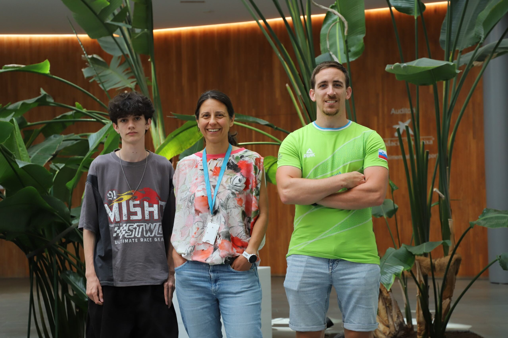

{width="618"}

## Introducción

La regulación de la expresión génica es el perfeccionamiento de la síntesis del producto funcional de los genes y es uno de los procesos más esenciales para la vida. Se trata del proceso que hace que diferentes tipos de células tengan diferentes propiedades y permite diferenciar las células sanas de las no sanas. La expresión génica es regulada por señales internas (actividad de otros genes, mutaciones, etc.) y por señales externas (dieta, temperatura, terapias farmacológicas, etc.).

## Nuestra investigación

Nuestra investigación se centra en tres áreas principales:

1.  En primer lugar, estudiamos el efecto del entorno sobre los cambios en la expresión génica que se transmiten de padres a hijos. Buscamos comprender cómo la información sobre nuestra exposición a diferentes entornos se pueda codificar en moléculas (distintas del ADN) en el interior de células que se transmiten entre generaciones.

2.  En segundo lugar, trabajamos con ARN no codificantes y otros elementos no codificantes que influyen en la expresión génica. Estamos interesados en establecer qué elementos no codificantes afectan a la expresión génica y cómo lo hacen.

3.  Finalmente, buscamos comprender cómo afectan los fármacos epigenéticos a la expresión génica y la cromatina en diferentes contextos genómicos. Entre los fármacos epigenéticos que se emplean actualmente en el ámbito clínico se incluyen los utilizados para el tratamiento de pacientes con leucemia mieloide aguda y síndrome mielodisplásico. Un conocimiento más en profundidad de los efectos de estos fármacos y de cómo funcionan permitiría mejorar los tratamientos y lograr una medicina más personalizada con vistas al futuro.

## Nuestros objetivos

Nuestro objetivo es contribuir a una mayor comprensión de la regulación génica y de las consecuencias en la expresión génica de los tratamientos farmacológicos y de la variación genética entre individuos. Aunque la mayor parte de nuestra investigación se basa en datos obtenidos en modelos animales o líneas celulares, esperamos que, a largo plazo, los conocimientos adquiridos mejorarán nuestra comprensión de lo que sucede en humanos. En el cáncer es extremadamente común que se produzca una extensa expresión génica aberrante y una gran desregulación del genoma, especialmente en los cánceres de tipo hematológico, que ya están siendo tratados con terapias dirigidas a las vías de regulación génica. Por último, pero no por ello menos importante, esperamos que los datos que obtengamos y los métodos de análisis que desarrollemos sirvan como herramientas útiles a una comunidad investigadora más amplia.

## Nuestros retos

Esperamos que nuestra investigación arroje luz sobre las siguientes cuestiones:

-   ¿Qué mecanismos epigenéticos están implicados en la transmisión entre generaciones de los rasgos adquiridos o variables tanto en humanos como en otros animales?
-   ¿Qué elementos no codificantes del ADN afectan a la expresión génica y, por tanto, potencialmente al fenotipo?
-   ¿Cómo afectan los fármacos (como los empleados para el tratamiento de cánceres sanguíneos) a la expresión génica y a la función de las partes no codificantes de nuestro genoma?

|                                                |                      |
|:-----------------------------------------------|----------------------|
| {width="160"} | Tanya Vavouri        |
| {width="160"}           | Adrià Mitjavila      |
| {width="160"}  | Kevin Megias Alvarez |
